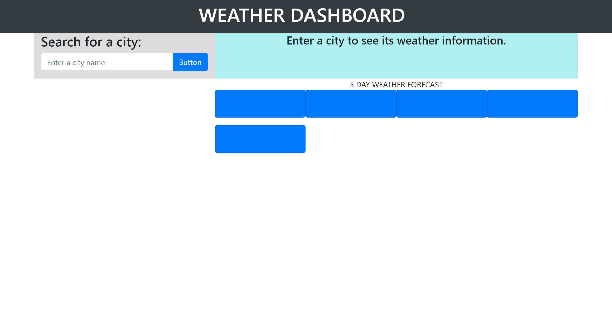
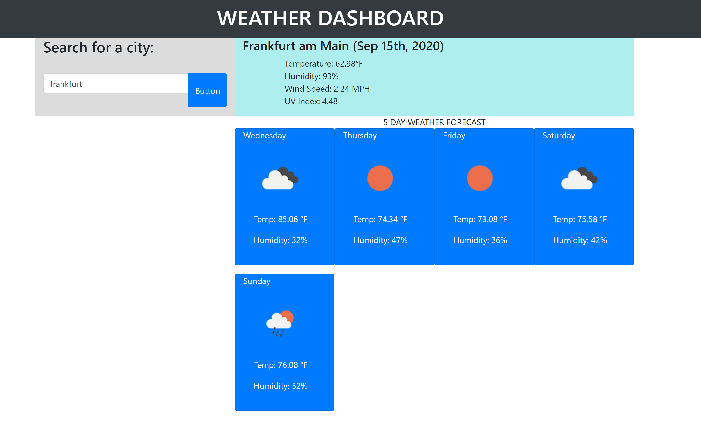

# Weather-Dashboard-App# Weather-Dashboard

## Description

Do you need to check the weather in your city? How about the weather in the city you plan to visit within the week? You can do just that here in this weather application! All you need to do is type in your city of choice, press enter, and there you have it! You'll get the temperature, humidity, wind speed, and the UV index of the day, AND the weather forecast for the next five days!

This project was much harder, of course, than the previous ones. I was unable to fully complete it by not getting the local storage to work and not having the search history cities to show below the search bar. With more time, I surely would have completed this, but that is not the case in a Bootcamp course. It's very unfortunate, but I am still proud of what I made because it helped me to learn concepts I couldn't understand before this.

## Credits

Thank you so much to the other students in the Bootcamp with me, who spend hours on hours working together and helping each other when we need it.

## Layout

Official Site: https://jamjon94.github.io/Weather-Dashboard-App/

Here's what to expect!

## License

Copyright (c) [2020] [JamieJones]

Permission is hereby granted, free of charge, to any person obtaining a copy of this software and associated documentation files (the "Software"), to deal in the Software without restriction, including without limitation the rights to use, copy, modify, merge, publish distribute, sublicense, and/or sell copies of the Software, and to permit persons to whom the Software is furnished to do so, subject to the following conditions:

The above copyright notice and this permission notice shall be included in all copies or substantial portions of the Software.

THE SOFTWARE IS PROVIDED "AS IS", WITHOUT WARRANTY OF ANY KIND, EXPRESS OR IMPLIED, INCLUDING BUT NOT LIMITED TO THE WARRANTIES OF MERCHANTABILITY, FITNESS FOR A PARTICULAR PURPOSE AND NONINFRINGEMENT. IN NO EVENT SHALL THE AUTHORS OR COPYRIGHT HOLDERS BE LIABLE FOR ANY CLAIM, DAMAGES OR OTHER LIABILITY, WHETHER IN AN ACTION OF CONTRACT, TORT OR OTHERWISE, ARISING FROM, OUT OF OR IN CONNECTION WITH THE SOFTWARE OR THE USE OR OTHER DEALINGS IN THE SOFTWARE.
